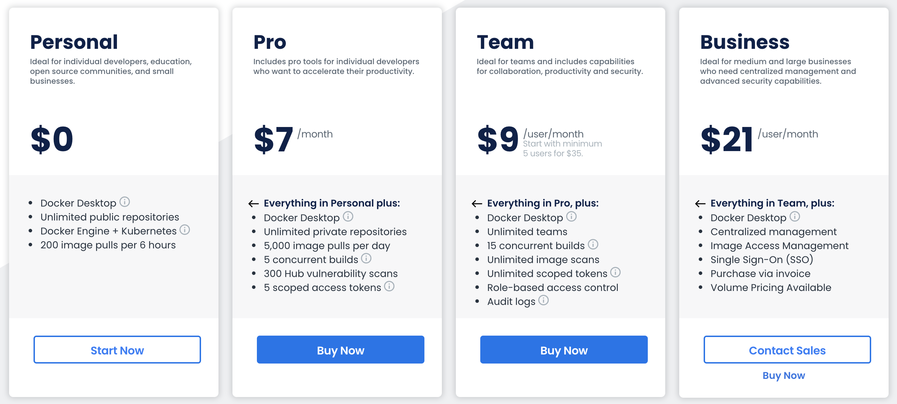

<style>

.reveal pre code {
  max-height: 900px;
  font-size: 15px;
  line-height: normal;
}

#logo {
	width: 20%;
	vertical-align:middle;
	background-color: transparent;
	border:0;
}

#me {
    font-size: 0.7em !important;
}

.reveal table th, .reveal table td {
    padding: 0em 0em 0em 0em;
}

.reveal section td p,ul {
  font-size: 0.7em;
}

.image-txt-container {
  display: flex;
  align-items: center;
}

</style>


## A Docker Desktop alternative

<div>


</div>

@SfeirLille - 02/2022

Note:

---

<div>
  <h2>About me</h2>
  <pre class="yaml">
    <code id=me>
  who : Thibauld Dujardin
  mission : Dev Backend / DevOps 
  certs :
    gcp :
        - name : architect
  hobbies : 
    - sports
    - domotic
    - video games
    </code>
  </pre>
</div>

Note:
- Thibauld Dujardin
- Dev Backend / Devops chez Decathlon / Feature Masterpice
- Chez sfeir depuis Septembre 2020
- Aujourd'hui je vous proposer de parler de la migration Docker Desktop vers Minikube

---

## Context

<iframe src="https://giphy.com/embed/25KEhzwCBBFPb79puo" width="480" height="270" frameBorder="0" class="giphy-embed" allowFullScreen></iframe>

Note:
* Before start - Some history fact
  * Aug 31, 2021 - Annoucement pricing / updated terms effective
  * January 31, 2022 - end of the grace period 
  * Mac os users & windows users 
    * Docker is for made for linux kernerl
  * Alternative is mostly a RootLess VM
* DockerDesktop is the only one impacted
  * Not Docker Engine nor Moby 
    * Moby is an open framework created by Docker to assemble specialized container systems without reinventing the wheel. It provides a “lego set” of dozens of standard components and a framework for assembling them into custom platforms.
    containerd by default 
* Docker Machine is deprecated

----

## Who is impacted



Note: 
- small businesses
    - fewer than 250 employees OR less than $10 million in revenue
    - personal use
    - education
    - non-commercial open source projects
- Individual developer
- Development teams 5+
- Medium and large businesses 50+

---

## Alternatives 

- Colima
- Rancher Desktop
- Podman
- Minikube

----

### Colima 

- Intel and M1 Macs support
- Simple CLI interface
- Docker and Containerd support
- Port Forwarding
- Kubernetes

https://github.com/abiosoft/colima

Note:
- based on Lima
  - Containers in Lima. = Colima
  - Lima can be considered as a some sort of unofficial "containerd for Mac".
  - Lima launches Linux virtual machines with automatic file sharing and port forwarding (similar to WSL2), and containerd.
- Limitations
  - Some command like docker compose still don't work very well ( complicated docker compose )
  - Still in a early stage
  - mount volume complicated 
  - bad performance
  - community active

----

### Rancher Desktop

<div>
    
</div>

- Container Management
- Windows,linux and Macs support (Intel and M1)
- Kubernetes Made Simple
- Desktop application
- Port Forwarding
- open-source desktop application

https://rancherdesktop.io/

Note: 
- based on Lima
- Limitations
  - Kubernetes can't be stopped 

----

<div>
    
</div>

- Daemonless
- alias docker=podman
- Docker & pod format
- Root or rootless
- Port Forwarding
- Volume mounts
- Maintainer : Containers https://github.com/containers

https://podman.io/

Note:
- Podman is a utility provided as part of the libpod library. 
  It can be used to create and maintain containers. 
- Windows - WSL2 - Mac - linux
- Limitations
  - Docker compose still not supported entirely (podman-compose)
  - Difficult customization
  - open-source
- Buildah - a tool that facilitates building
- `--privileged`

----

<div>
    
</div>

- "Drag & Drop"
- Dashboards
- Container Runtime: Docker, CRI-O, et containerd
- part of the kubernetes project
- Volume
- Kubernetes can be turned off

https://github.com/kubernetes/minikube

Note: 
- Limitations
  - Difficult error message
  - some customization may be required

---

## Minikube Requirement

- minikube 
- hyperkit 
- docker 
- docker-compose
- zsh (optional)

```shell
brew install minikube hyperkit docker docker-compose
```

Note: 
- Hyperkit
  - HyperKit is a toolkit for embedding hypervisor capabilities in your application. 
  - It includes a complete hypervisor, which is optimized for lightweight virtual machines and container deployment.
  - It is designed to be interfaced with higher-level components such as the VPNKit and DataKit.
  - no `localhost`

----

## Let's go

<iframe src="https://giphy.com/embed/BpGWitbFZflfSUYuZ9" width="480" height="400" frameBorder="0" class="giphy-embed" allowFullScreen></iframe>

----

<pre class="bash">
<code data-line-numbers="1|2|3|4|5|6|7">
<script type="text/template">minikube start \
    --driver=hyperkit \
    --container-runtime=docker \
    --no-kubernetes \
    --vm=true \
    --cpus 6 \
    --memory 8000</script>
</code>
</pre>

<div class="fragment"> 
<pre class="bash">
<code>minikube start
minikube stop
minikube delete
minikube ip
minikube pause</code>
</pre>
</div>

Note: 

* `-drive=hyperkit` best drive to use with macos can be change to `VirtualBox` etc. You can even use your local docker (Linux only)
* `--container-runtime=docker` the runtime we use on the minikube's vm. Can be `containerd` or `cri-o` 
* `--cpus 6` at least 6 cpu for a K8S cluster 
* `--memory` at least 8 Go required for K8S 

----

### Pull images from external registry
<div class="fragment"> 
<pre class="bash">
<code>
<script type="text/template">minikube ssh -- sudo sed -i "/Network/aDNS=8.8.8.8" /etc/systemd/network/10-eth1.network
minikube ssh -- sudo sed -i "/Network/aDNS=8.8.8.8" /etc/systemd/network/20-dhcp.network
minikube ssh -- sudo systemctl restart systemd-networkd </script>
</code>
</pre>
</div>

<div class="fragment"> 
<pre class="bash">
<code>
<script type="text/template">minikube ssh -- sudo resolvectl dns eth0 8.8.8.8 8.8.4.4
minikube ssh -- sudo resolvectl dns docker0 8.8.8.8 8.8.4.4
minikube ssh -- sudo resolvectl dns sit0 8.8.8.8 8.8.4.4</script>
</code>
</pre>
</div>

Note:
* For some unknown reason some time the `systemd-networkd` wont restart
* Both methods are valid
* Only mandatory if there is a proxy that is already set up like Zscaler

----

### `localhost` ?

<div class="fragment"> 
<pre class="bash">
<code>sudo sed -i '' "/minikube/d" /etc/hosts
echo "$(minikube ip)\tminikube.local" | sudo tee -a /etc/hosts</code>
</pre>
</div>

<div class="fragment">
<pre class="bash">
<code>
<script type="text/template">minikube ip
> 192.168.64.24
 
cat /etc/hosts/
  192.168.64.24	minikube.local
</script>
</code>
</pre>
</div>

Note: 
* Do not forget to remove the old one if you do it manually
* not required if you use Virtualbox

----

### Connection to the Docker

<div class="fragment"> 
<pre class="bash">
<code>eval $(minikube docker-env)</code>
</pre>
</div>

<div class="fragment"> 
<pre class="bash">
<code>export DOCKER_TLS_VERIFY="1"
export DOCKER_HOST="tcp://192.168.64.23:2376"
export DOCKER_CERT_PATH="/Users/THIBAULD/.minikube/certs"
export MINIKUBE_ACTIVE_DOCKERD="minikube"
# To point your shell to minikube's docker-daemon, run:
# eval $(minikube -p minikube docker-env)</code>
</pre>
</div>

<div class="fragment"> 
<pre class="bash">
<code>echo "\neval \$(minikube -p minikube docker-env)" | sudo tee -a ~/.zshrc</code>
</pre>
</div>

Note:
* The classic `localhost` wont work
* This command can be required some time, that's why we need it in the .zshrc

----

### Mounting volume

<div class="fragment"> 
<pre class="bash">
<code>minikube mount {source directory}:{target directory}</code>
</pre>
</div>

<div class="fragment"> 
<pre class="bash">
<code data-line-numbers="8-9">
<script type="text/template">minikube start \
    --driver=hyperkit \
    --container-runtime=docker \
    --no-kubernetes \
    --vm=true \
    --cpus 6 \
    --memory 8000
    --mount-string {source directory}:{target directory} 
    --mount</script> 
</code>
</pre>
</div>

<div class="fragment"> 
<pre class="bash">
<code data-line-numbers="8-9|10">
<script type="text/template">minikube start \
    --driver=hyperkit \
    --container-runtime=docker \
    --no-kubernetes \
    --vm=true \
    --cpus 6 \
    --memory 8000
    --mount-string /Users/THIBAULD/Documents/GitHub:/Users/THIBAULD/Documents/GitHub 
    --mount
    -p test-mount</script> 
</code>
</pre>
</div>

Note:
* `-p test` use another profile named `test`, the default one is named `minikube`

---

### known issues

```shell
Cannot connect to the Docker daemon at tcp://192.168.64.23:2376. 
Is the docker daemon running?
```

<div class="fragment"> 
<pre class="bash">
<code>
<script type="text/template">eval $(minikube docker-env)</script> 
</code>
</pre>
</div>

```shell
Failed to pull image "registry.example.com:5000/nginx": 
rpc error: 
  code = Unknown 
desc = Error response from daemon: 
  Get http://registry.example.com:5000/v2/: 
    dial tcp 127.0.0.1:5000: connect: connection refused 
```

<div class="fragment"> 
<pre class="bash">
<code>
<script type="text/template">> dns_setter</script> 
</code>
</pre>
</div>

```
Docker-compose
```

<div class="fragment"> 
<pre class="bash">
It depends on the use case and what features you need
</pre>
</div>

Note:
*  Reset the current context to use the Minikube engine : `eval $(minikube docker-env)`
*  Check that the IP in `/etc/hosts/` is still the same as the one returned by `minikube ip` (sudo) & eval cmd
*  Check that the DNS is set right inside the vm / the sysmtemd has restarted
* Docker compose
  * Some things are different
  
---

## Demo 

---

<iframe src="https://giphy.com/embed/090VWZvZoOyn0xFtXo" width="480" height="400" frameBorder="0" class="giphy-embed" allowFullScreen></iframe>

Note: 

* drag & drop docker solution 
* kubernetes available too 
* suitable for most use case 
* rootless env 
* free 

---

## Questions ?

<iframe src="https://giphy.com/embed/k6r6lTYIL9j9ZeRT51" width="480" height="400" frameBorder="0" class="giphy-embed" allowFullScreen></iframe>